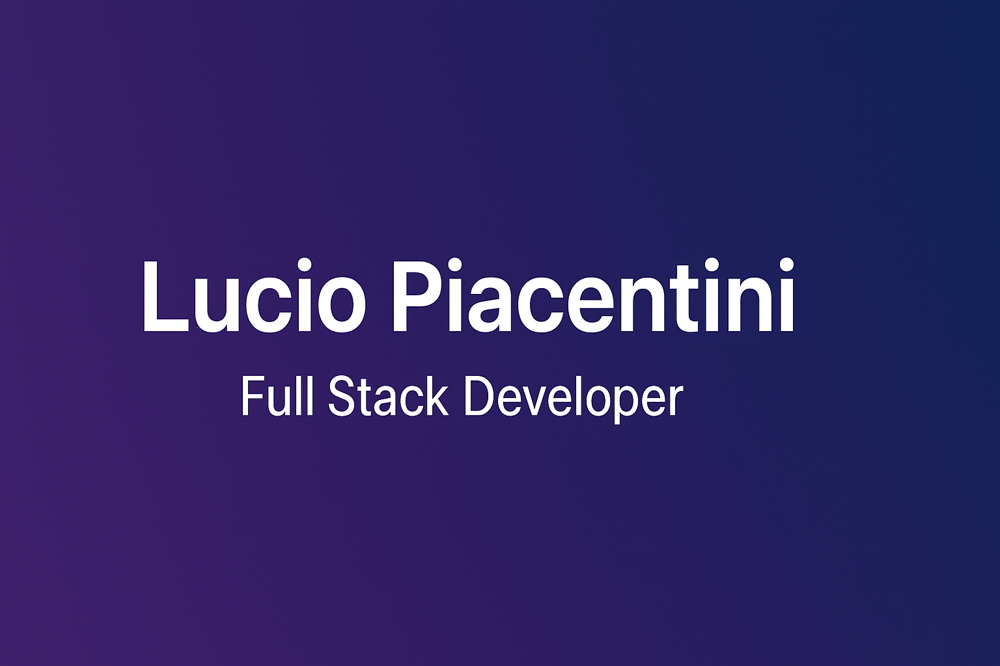

# Hola 👋, soy Lucio Piacentini
Desarrollador Full Stack | PHP, Laravel, Vue, Nuxt, MySQL, Docker , React, Node.js, Supabase
📍 Villa María, Córdoba, Argentina

## 🚀 Proyectos Destacados

- 🔷 **PlanoYa**  
  Ecommerce de planos para casas y edificaciones.  
  Desarrollado con Laravel, Vue y Vuetify.  
  🔗 [Sitio web](https://planoya.com.ar)  
  🔒 [Repositorio privado](https://gitlab.com/planoya/dev-planyoya)

- 🌍 **jsImportaciones**  
  Plataforma de gestión de importaciones internacionales para negocios de reventa y tecnología.  
  Incluye cotizaciones en tiempo real, control de stock, y administración de pedidos.  
  🔗 [Sitio web](https://jsimportaciones.com.ar)  
  📁 [Repositorio en GitLab](https://gitlab.com/luciopiacentini14/app-jsimportaciones)

<!-- - 📊 **Sistema contable Laravel + React**  
  Aplicación de gestión para comercios: control de stock, facturación, productos y reportes.  
  Arquitectura desacoplada: Laravel API + React SPA.  
  🔧 (Repositorio privado por el momento) -->

## 🛠 Tecnologías

📫 **Contacto:** luciopiacentini14@gmail.com

<!--
**lucho9696/lucho9696** is a ✨ _special_ ✨ repository because its `README.md` (this file) appears on your GitHub profile.

Here are some ideas to get you started:

- 🔭 I’m currently working on ...
- 🌱 I’m currently learning ...
- 👯 I’m looking to collaborate on ...
- 🤔 I’m looking for help with ...
- 💬 Ask me about ...
- 📫 How to reach me: ...
- 😄 Pronouns: ...
- ⚡ Fun fact: ...
-->
